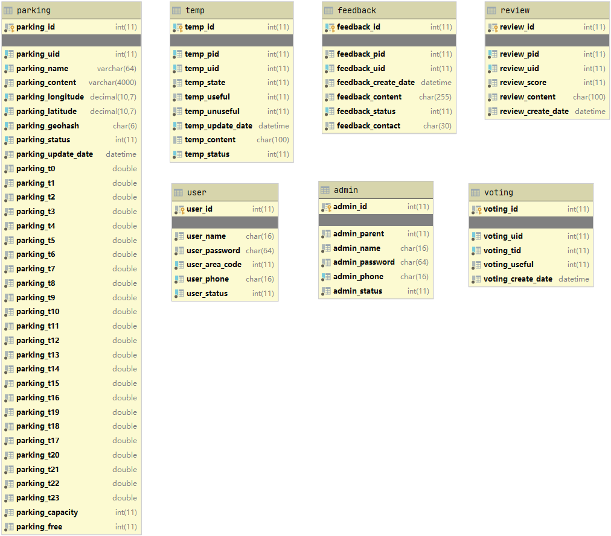
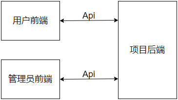
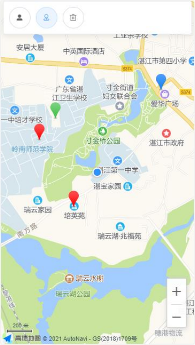
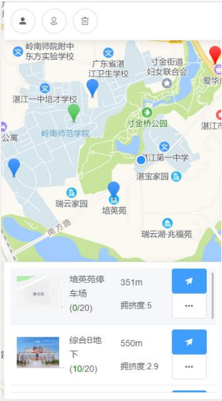
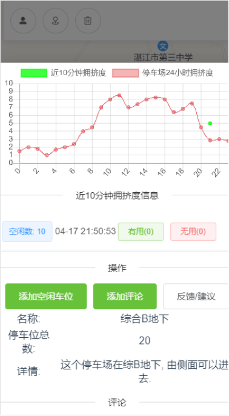
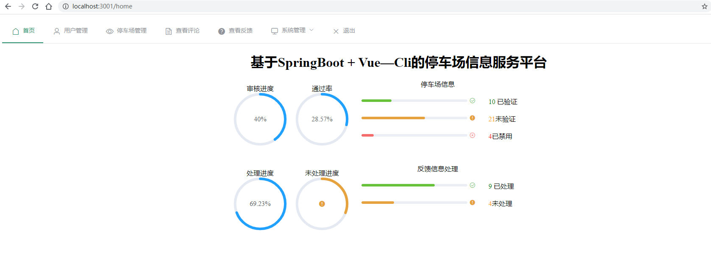
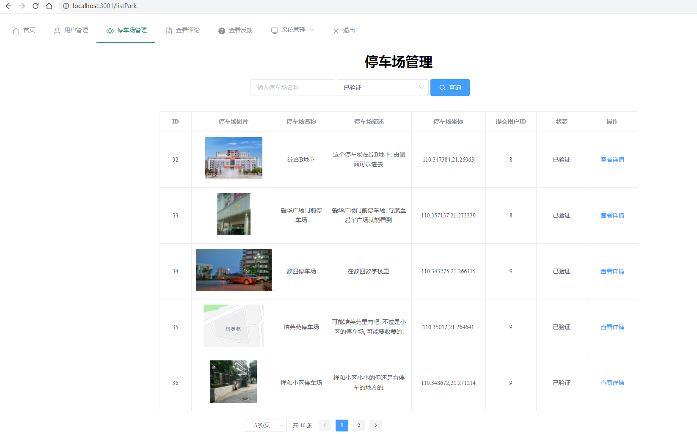

# 基于众包的"共享停车服务＂后台

## 1. 简介

随着我国经济社会持续快速发展,汽车保有量逐年增加,”停车难”已经成为了困扰人们日常生活的问题.针对这方面的课题,也有很多学者开展了相关的研究.比如: 王先杰等(2019) 以蓝牙模块为基础设计出共享车位的检测系统[3];徐嘉潞等(2019)设计智能车位锁推广应用共享车位[4];黄振宇等(2018)设计互联网+的找寻空闲车位的方式解决城市空闲停车利用率低的问题[5]; 俞建民等(2018)针对基于微信小程序的车位共享平台设计提出了探讨[6];陈霞(2017)提出了众包获取海量车位信息的研究和服务模式框架[7]. 从以上研究成果可以看出,目前国内对于”停车难”问题硬件解决方案的维护成本较高,对于没有成型停车场的一些地区不友好,而且相关的研究仅针对”商圈,学校,医院,居民区”等人口较密集的区域,而忽略了人口密集程度低的路段停车位利用率不高的问题,再者学者们对”众包”探索停车位模式的研究时间均不长.因此,针对社会上依旧还存在停车位信息不对称的”停车难”问题.本项目从提高公共车位利用率,减少停车位和车主间信息不对称的目的出发,提出基于众包和微信小程序的探索停车位的解决方案.

### 1.1 说人话

通过该系统用户可以获取公共停车场的一些信息, 比如某时段内停车场的拥挤度情况. 用户可以提交位置偏僻的停车场以提高整体停车位的利用率.

### 1.2 项目亮点

- 题材新颖并脱离实际(毕设答辩老师说的).
- 清爽的代码分层风格(我假装摸着自己的良心).
- 性能狂魔疯狂优化 SQL , 比如对所有 SQL 都建立了适当的索引, 不给用户提供页数功能, 使用多查一条数据来判断是否有下一页进行分页. 减少了一条分页数的查询.
- 实现基于 JWT 的 Shiro 鉴权过滤器.
- i18n 国际化(请求头加上 Accept-Language. 值为 en 或者 ch)

### 1.3 项目需求

用户:
- 注册登录
- 根据坐标查询附近的已验证的停车场
- 查询停车场详情信息(空闲车位数, 评论)
- 查询个人信息, 提交的停车场, 空闲车位数, 评论, 反馈
- 添加停车场, 空闲车位数, 评论, 反馈

管理员:
- 管理用户, 停车场, 反馈等, 查看评论
- 新增/禁用其他子管理员

### 1.4 数据库的设计

#### Q&A

1. 为什么使用前缀这种字段命名风格? 好问题, 当时脑子抽了.

user: 用户表
- user_id: 用户id
- user_name: 用户名
- user_password: 用户密码Hash
- user_area_code: 用户手机区号
- user_phone: 用户手机号
- user_status: 账户状态(0未验证1已验证2已锁定)

parking: 停车场信息表
- parking_id: 停车场id
- parking_uid: 提交的用户id
- parking_name: 停车场名称
- parking_content: 停车场描述
- parking_longitude: 停车场高德地图经度坐标
- parking_latitude: 停车场高德地图纬度坐标
- parking_geohash: 根据坐标编码的6位GeoHash, 用于做查询索引
- parking_status: 停车场状态: 0.未验证1.已验证2.已禁用
- parking_update_date: 停车场信息更新时间
- parking_t0 ~ parking_t23: t0~t23 每个时段的拥挤度状态(0~10)
- parking_capacity: 停车场车位数, 也就是停车场的容量
- parking_free: 停车场当前空闲停车位数量

temp: 用户提交的空闲停车位信息表
- temp_id: 信息id
- temp_pid: 停车场id
- temp_uid: 提交的用户id
- temp_state: 空闲车位数量
- temp_useful: 有价值的投票数量
- temp_unuseful: 无价值的投票数量
- temp_update_date: 信息更新时间
- temp_content: 描述
- temp_status: 信息的回收状态(0未回收1已回收)

voting: 信息投票表
- voting_id: 投票id
- voting_uid: 用户id
- voting_tid: 信息id
- voting_useful: 用户的选择, 是否有帮助(0未选择-1无帮助1有帮助)
- voting_create_date: 投票创建时间

review: 停车场评论表
- review_id: 评论id
- review_pid: 停车场id
- review_uid: 用户id
- review_score: 用户评分
- review_content: 评论内容
- review_create_date: 评论创建时间

feedback: 信息反馈表
- feedback_id: 反馈id
- feedback_pid: 反馈的停车场
- feedback_uid: 反馈的用户id
- feedback_create_date: 反馈的创建时间
- feedback_content: 反馈的内容
- feedback_status: 反馈的状态(0未处理1已处理)
- feedback_contact: 反馈的联系方式

admin: 管理员表
- admin_id: 管理员id
- admin_parent: 父级管理员id
- admin_name: 管理员用户名
- admin_password: 管理员密码
- admin_phone: 管理员手机号
- admin_status: 管理员账号状态(0未激活1正常2封禁)

### 1.5 简简单单画个架构图

用户前端: 在目录 UI/parking_user/ 下就是用户前端, 是用Vue-Cli3做的
管理员前端: 在目录 UI/ParkingVue-Admin/ 下就是管理员前端, 这个应该是Vue-Cli2, 我都忘了

#### Q&A

1. 为什么项目结构这么简单? 这个嘛, 俺是技术菜鸟.

## 2. 如何运行?

1. 如果你用的是 Windows 系统, 那么恭喜你请先在 C 盘创建一个名为 parking 的目录来存放平台上传停车场的图片. 都以 {停车场id}.jpg 命名.
2. 新建名为 parking 的数据库, 导入 database.sql 到数据库, 我用的是 MySQL 5.7.30 版本差异请自行解决.
3. 启动后端服务, 控制台没有输出异常就 OK.
4. 导入 ParkingProject.postman_collection.json API 接口文件, 该文件是我用 postman 导出的.
5. 使用喜欢的接口测试工具就可以测试接口了. 默认端口 8080 (http) .
6. 启动用户前端, 路径在 /UI/parking_user/, 具体请看其对应的 README.MD.
7. 启动管理员前端, 路径在 /UI/ParkingVue-Admin/, 具体请看其对应的 README.MD.

#### Q&A

1. 前端项目启动问题: 
- 如果你发现启动后地图组件无法使用, 那也有可能是我申请的高德地图 key(8ea0ea09e10e77939c5114f53a52eac4) 被限制了, 你可以自己申请一个替换掉 Home.vue 里面的那段 key.
- 启动后浏览器请打开浏览器控制台窗口, 将页面切换成移动端设备, 如果控制台报错就多刷新几次方可正常使用.

#### 前端运行示例图:

控制台模拟定位到坐标(21.269648, 110.347554), 刷新页面, 就会显示其附近停车场信息:

点击相应的停车场坐标点, 就能列出附近停车场的距离和当前空闲信息:

查看该停车场的详情信息, 就会有图表展示的系统24小时内拥挤度变化曲线, 最近的拥挤度信息, 添加拥挤度状态/评论按钮等, 查看评论信息.

#### 后端运行示例图

## 3. 其它

[一键看代码](https://github1s.com/thesomeexp/ParkingProject)
