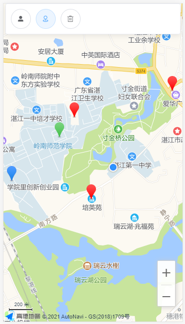
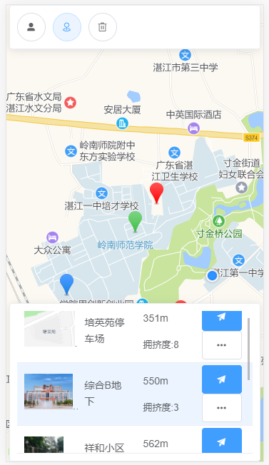
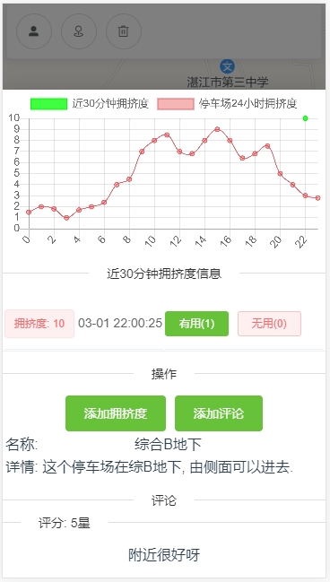

# 共享停车服务平台-用户前端

前端截图示例:

介绍:

每位注册的用户都可以提交他发现的停车场信息, 管理员审核通过后该停车场就能被其他用户查看到了. 用户可以根据定位查询到他附近的一些停车场信息, 下面的图中, 有标记的点的地方为存在停车场的地方, 根据当前时段系统预估的拥挤度情况, 每个小标记点的颜色都不同(拥挤度评分范围为0到10, 停车场拥挤度小于3的标记为绿色, 大于7的为红色, 其余为蓝色):



点击相应的停车场坐标点, 就能列出附近停车场的距离和当前拥挤度信息.



查看该停车场的详情信息, 就会有图表展示的系统24小时内拥挤度变化曲线, 最近的拥挤度信息, 添加拥挤度状态/评论按钮等, 查看评论信息. 



# parking_user

## Project setup
```
yarn install
```

### Compiles and hot-reloads for development
```
yarn serve
```

### Compiles and minifies for production
```
yarn build
```

### Lints and fixes files
```
yarn lint
```

### Customize configuration
See [Configuration Reference](https://cli.vuejs.org/config/).
